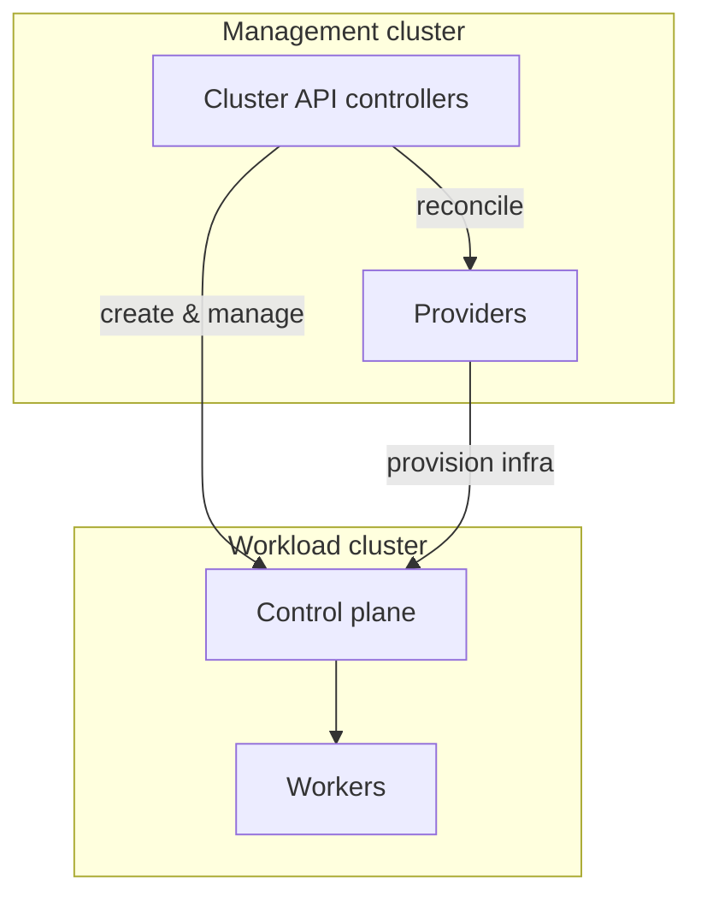
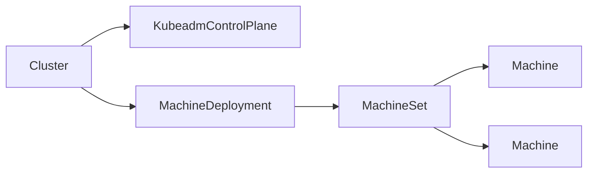
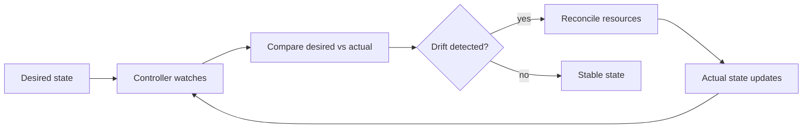
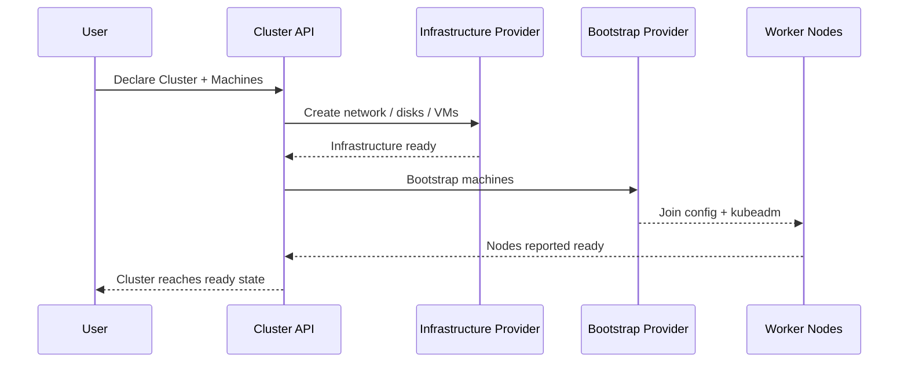

## <i class="fa-duotone fa-solid fa-rocket"></i> Why this matters
- Most teams still script cluster creation and upgrades by hand
- Manual provisioning leads to drift, inconsistency, and slow recovery
- Kubernetes already has the right control-loop model for managing cluster lifecycle

---

## <i class="fa-duotone fa-solid fa-server"></i> What is Cluster API?
- Cluster API exposes cluster lifecycle as Kubernetes resources and controllers
- It runs in a management cluster and reconciles workload clusters declaratively
- It is a portable abstraction over infrastructure, bootstrap, and control-plane provisioning

---

## <i class="fa-duotone fa-solid fa-bug-slash"></i> The problem it solves
- One cluster can be created with scripts; many clusters cannot be managed consistently that way
- Drift appears when each environment uses slightly different provisioning logic
- Cluster API standardizes cluster lifecycle as a declarative API instead of custom commands

---

## <i class="fa-duotone fa-solid fa-brain"></i> The key mental model
- The source of truth is the desired state declared in Kubernetes objects
- Controllers continuously compare that state to reality and reconcile differences
- This is the same model Kubernetes uses for workloads, so it scales well for infrastructure too

---

## <i class="fa-duotone fa-solid fa-diagram-project"></i> Management cluster vs workload cluster
- A management cluster hosts the Cluster API controllers and provider integrations
- A workload cluster is the cluster being created, upgraded, and managed by that control plane
- The management cluster is not the app cluster; it is the provisioning control plane



---

## <i class="fa-duotone fa-solid fa-cubes"></i> Core resources
- Cluster: the logical definition of a cluster and its topology
- Machine: one node instance that will be created or replaced
- MachineSet: a group of machines that should exist at a given replica count
- MachineDeployment: manages rollout and replacement of machine sets over time
- Control plane resources: define how the control plane is bootstrapped and upgraded



---

## <i class="fa-duotone fa-solid fa-cloud"></i> Infrastructure providers
- Cluster API stays generic; providers implement the cloud or environment-specific details
- Providers create VMs, networking, disks, load balancers, and other infrastructure dependencies
- This keeps the API portable while letting each platform provide its own machinery

---

## <i class="fa-duotone fa-solid fa-wand-sparkles"></i> Bootstrap providers
- Bootstrap providers prepare a machine to join the target cluster
- They handle OS configuration, kubeadm setup, and join details
- Splitting bootstrap from infrastructure makes the process more modular and portable

---

## <i class="fa-duotone fa-solid fa-repeat"></i> The reconciliation loop
- Controllers continuously watch Cluster API objects and provider state
- They compare desired state with actual state and identify drift
- They create, patch, or replace infrastructure until the cluster converges to the desired model



---

## <i class="fa-duotone fa-solid fa-arrows-spin"></i> Cluster creation flow
- Define infrastructure resources such as networks, disks, and compute objects
- Define the Cluster object and control plane topology
- Create Machine or MachineDeployment objects for the workers
- Providers create the nodes and bootstrap them into the cluster
- The control plane and workers converge until the cluster reaches a ready state



---

## <i class="fa-duotone fa-solid fa-network-wired"></i> Control plane and workers
- The control plane runs the API server, controller manager, and related services
- Workers run application workloads and are usually scaled independently
- Cluster API treats both as managed resources with explicit lifecycle controls
- Provider implementations may differ, but the reconciliation model stays the same

---

## <i class="fa-duotone fa-solid fa-arrow-trend-up"></i> Upgrades and rolling changes
- Cluster API supports controlled replacement and rollout workflows
- MachineDeployment offers a structured model for worker-node lifecycle changes
- Control-plane upgrades can be managed in a provider-aware sequence
- The goal is repeatable, observable, and safer cluster evolution

---

## <i class="fa-duotone fa-solid fa-code-branch"></i> Why this is GitOps-friendly
- Cluster definitions are plain declarative manifests, usually stored in Git
- Changes are reviewable, repeatable, and auditable
- Drift is visible and can be reconciled by the controller loop
- This aligns well with platform engineering and infrastructure-as-code workflows

---

## <i class="fa-duotone fa-solid fa-people-group"></i> Multi-cluster management
- Many teams manage multiple environments with different topology and policies
- Cluster API makes those clusters reproducible from the same declarative model
- This reduces custom scripting and gives operators a consistent lifecycle pattern

---

## <i class="fa-duotone fa-solid fa-building-columns"></i> Platform engineering angle
- Cluster API gives platform teams a standard interface for cluster lifecycle management
- Developers request cluster capability through declarative objects instead of shell-driven flows
- Platform teams can enforce policies for networking, security, and standard node configuration

---

## <i class="fa-duotone fa-solid fa-earth-americas"></i> Real-world use cases
- Internal developer platforms with standardized Kubernetes offerings
- Multi-cloud or hybrid environments that need a common lifecycle model
- Bare-metal deployments where infrastructure provision must be tightly controlled
- Test and QA environments that must be reproducible and disposable

---

## <i class="fa-duotone fa-solid fa-triangle-exclamation"></i> Operational realities
- A management cluster is still required to run the controllers
- Provider maturity and capability vary across clouds and environments
- RBAC, security boundaries, and trust model still matter a lot
- Debugging usually means reading conditions, events, and controller logs

---

## <i class="fa-duotone fa-solid fa-circle-exclamation"></i> Common pitfalls
- Treating Cluster API as a cloud abstraction without learning the provider model
- Expecting identical behavior across all infrastructure backends
- Underestimating the need for observability and controller debugging
- Forgetting that Cluster API complements existing platform and tooling, rather than replacing all of it

---

## <i class="fa-duotone fa-solid fa-map-signs"></i> Where to start
- Start with the official Cluster API docs and project overview
- Try a minimal provider quick start in a lab environment
- Learn the core objects before provider-specific details and automation
- Use a tiny example cluster to understand the full lifecycle end-to-end

---

## <i class="fa-duotone fa-solid fa-gift"></i> Closing takeaways
- Cluster API makes cluster lifecycle part of Kubernetes’ declarative control plane
- It is provider-aware but infrastructure-agnostic at the core API layer
- It improves consistency, makes upgrades repeatable, and reduces custom scripting
- It is most valuable when a team operates many clusters or many environments

---

## <i class="fa-duotone fa-solid fa-terminal"></i> Demo flow
- Show one minimal Cluster definition
- Explain the infrastructure and Machine objects
- Walk through a scale-out or upgrade example
- Finish with controller conditions and reconciliation state

```bash
# 1) create a local kind management cluster
kind create cluster --name capi-mgmt

# 2) initialize Cluster API with the Hetzner provider
export HCLOUD_TOKEN="<your-hcloud-token>"
export HCLOUD_SSH_KEY="<ssh-key-name>"

clusterctl init \
  --infrastructure hcloud \
  --bootstrap kubeadm \
  --control-plane kubeadm

# 3) generate a workload cluster definition
export CLUSTER_NAME="demo-hcloud"
export KUBERNETES_VERSION=v1.37.0
export CONTROL_PLANE_MACHINE_COUNT=3
export WORKER_MACHINE_COUNT=5

clusterctl generate cluster ${CLUSTER_NAME} \
  --infrastructure hcloud \
  --kubernetes-version ${KUBERNETES_VERSION} \
  --control-plane-machine-count ${CONTROL_PLANE_MACHINE_COUNT} \
  --worker-machine-count ${WORKER_MACHINE_COUNT} \
  > ${CLUSTER_NAME}.yaml

# 4) apply it and watch the cluster come up
kubectl apply -f ${CLUSTER_NAME}.yaml
kubectl get clusters,machines,machinesets -A -w

# 5) fetch the kubeconfig once the cluster is ready
clusterctl get kubeconfig ${CLUSTER_NAME} > ${CLUSTER_NAME}.kubeconfig
kubectl --kubeconfig=${CLUSTER_NAME}.kubeconfig get nodes
```

This is a lightweight demo flow: a kind cluster hosts Cluster API, and the Hetzner provider creates the actual workload cluster resources.

---

## <i class="fa-duotone fa-solid fa-quote-right"></i> Final message
Cluster API is a way to make cluster creation and lifecycle management part of the same declarative Kubernetes model used for workloads and services.
